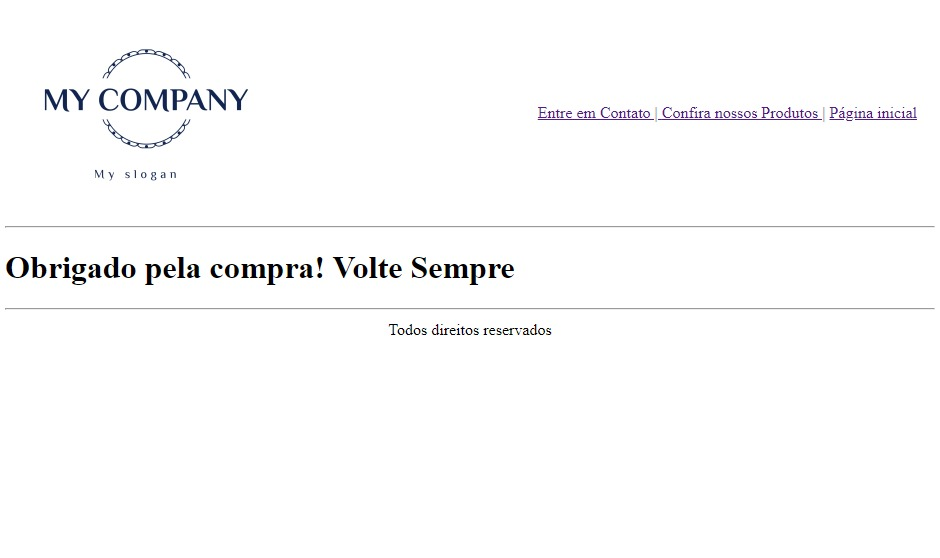

# Estudo-HTML

Este projeto tem como objetivo fornecer ferramentas para qualquer pessoa que deseje aprender comandos em HTML. Inicialmente, trataremos do que foi feito. A partir de puramente HTML, a base de um site de compras online foi criado:
Todas páginas terão a logo genérica e os links para as páginas posteriores.

## Tela Inicial

Nesta página é possível visualizar a possibilidade do Login e do Cadastro, e, neles, as entradas e botões necessários.

## Contato

Aqui, é possível adicionar alguma mensagem

## Produtos

Caso acessemos os produtos, podemos ver produtos genéricos e temos a opção de compra

## Pagamento

Se escolhermos comprar, acessamos a página de pagamento, onde podemos escolher finalizar a compra por algum método

## Agradecimento

Por fim, caso a compra seja finalizada, o agredecimento ocorre

**Atenção**: Neste projeto os dados inseridos não são tratados, apenas HTML foi usado!

##Comandos e Padrões essenciais

Uma boa forma de decorar comandos é escrevê-los e salva-los para consulta, segue abaixo os que eu mais uso até então:

